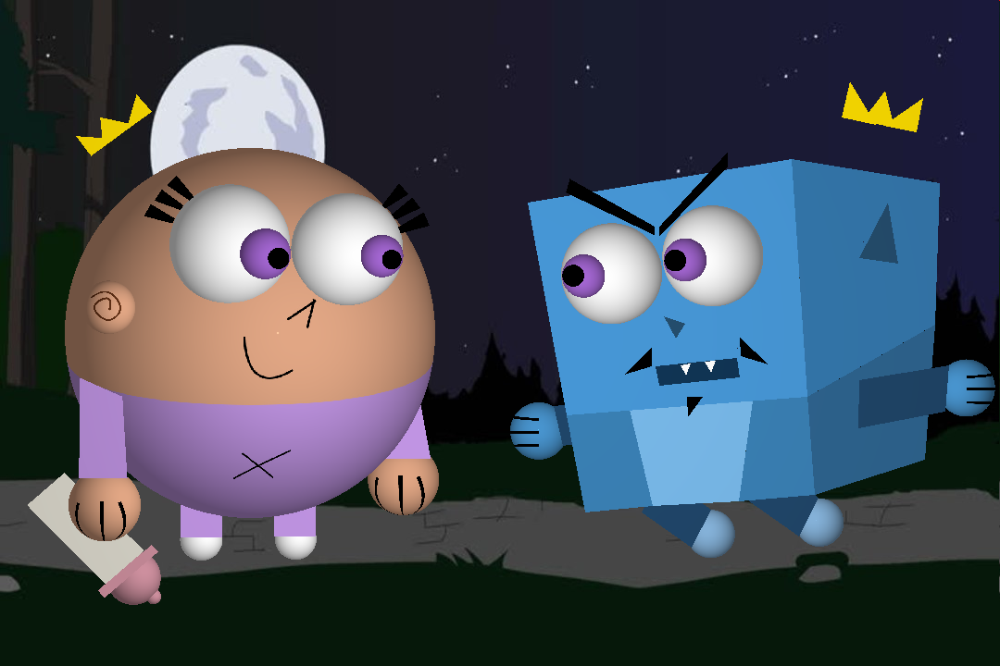

# ray-tracing

An implementation of the Ray Tracing algorithm in C++. You can provide a texture to the objects and you can draw the figures based on triangles. There are Spheres and Planes also implemented based on triangles. You can implemented your own shapes based on triangles and put it a class and used it to draw something. 

This implementation of Ray Tracing was used to generate this images:

You can build the images yourself running the files `main100randomSpheres.cpp` and `mainPoof.cpp`. To compile the code look the commands in the file `comandos.txt`

Random circles that overlap

Poof

